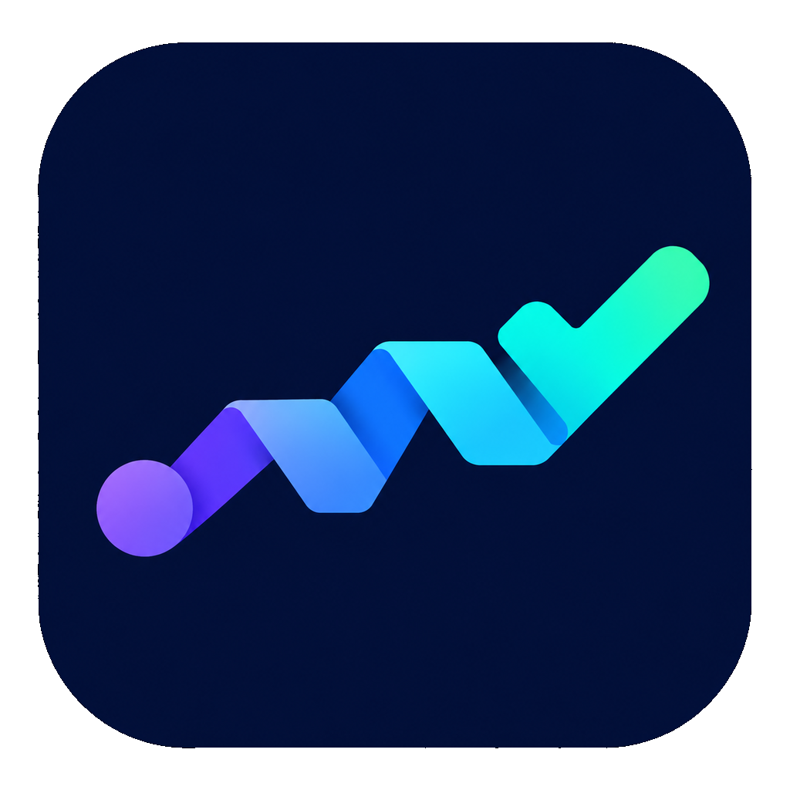
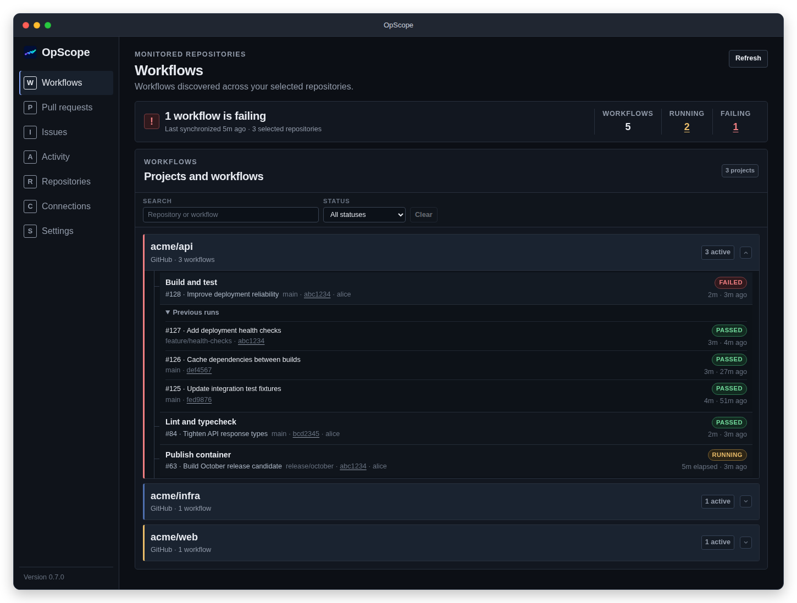
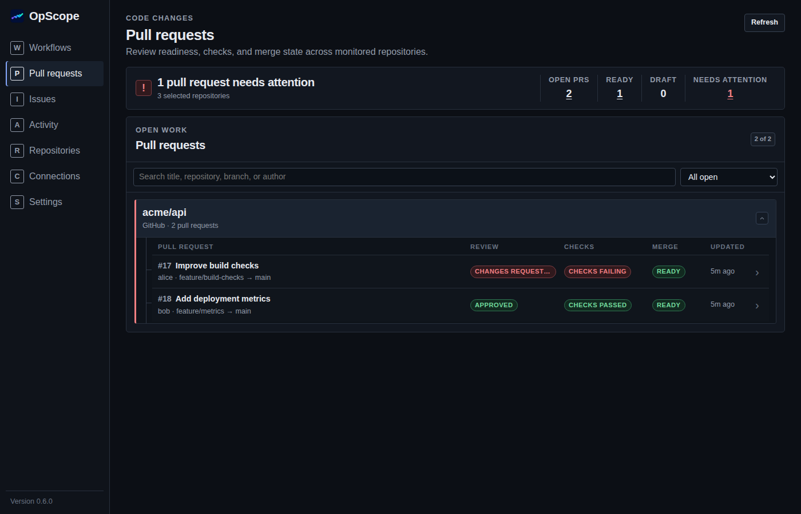
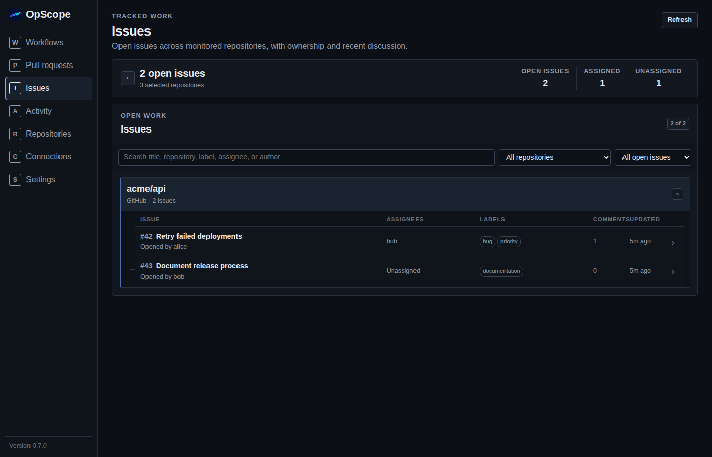
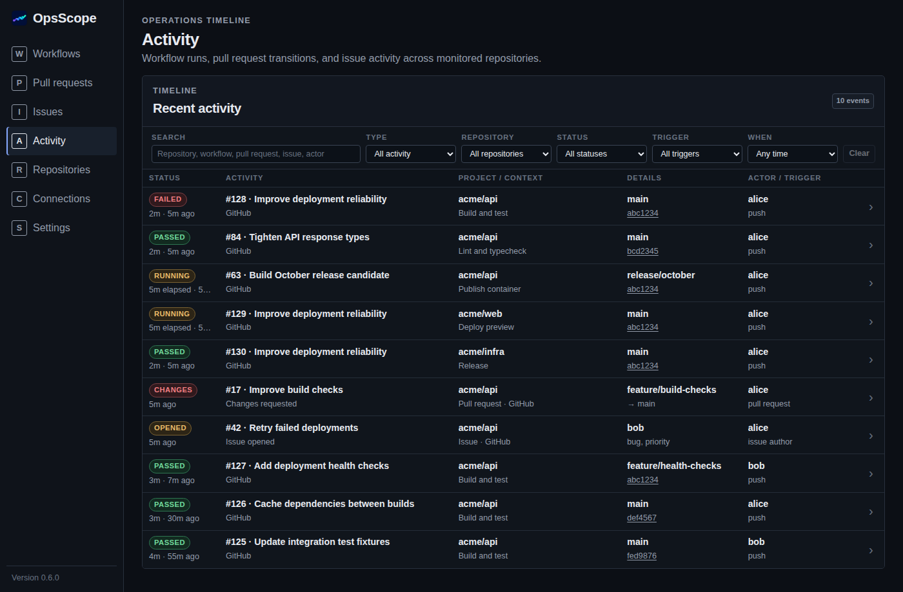

# OpsScope

<p align="center">
  
</p>

An operational dashboard for your repositories: see failing workflows, pull
requests that need attention, and open issues in one place. Run it on your
desktop or host it yourself.

## Why OpsScope?

Following work across repositories means switching between Actions pages,
pull request lists, and issue trackers just to answer “what needs my attention?”
OpsScope brings those signals together in a compact, project-grouped view.

It complements your source platform rather than replacing it. Inspect status,
activity, and run logs here; open the original page when you need to act.
Credentials and cached data stay on your machine or server, with no
OpsScope-hosted service required.

GitHub, GitLab, Gitea, and Bitbucket Cloud connect through the same source-module
architecture. Available features depend on the provider; see [Sources](#sources).

## Features

- **Workflows:** latest and previous runs, status filters, duration, and
  on-demand logs in a dialog.
- **Pull requests:** open PRs grouped by repository, with reviews, checks, and
  merge readiness. Supported workflow checks open run details directly.
- **Provider actions:** re-run workflows, update PR branches, and merge PRs
  through confirmation dialogs, where supported by the provider and permissions.
  See [Workflow and PR actions](#workflow-and-pr-actions).
- **Dependabot:** request rebase or recreate for GitHub Dependabot PRs from the
  PR dialog, with confirmation and a warning before recreating.
- **Issues:** open issues grouped by repository, with labels, assignees,
  milestones, details, and discussion.
- **Activity:** a combined feed of workflow runs, observed PR changes, and issue
  events, with filters and links to their details.
- **Background monitoring:** scheduled and manual refresh, cached results on
  reload, and freshness information when a source is unavailable.
- **Notifications:** workflow failures, PR updates, and issue updates through
  native desktop notifications or Apprise, with event controls in Settings.
- **Personal scope:** optionally show only work relevant to each connection's
  token owner, including notification filtering.

Both editions share the same core and UI. Each installation is intended for a
single user: there are no separate workspaces or per-user data permissions.
Workflow and PR dialogs provide confirmed provider actions where supported.
Editing issues and approving PRs are not supported.

## Screenshots

<table>
<tr>
<td width="50%">
<a href="screenshots/workflows.png"></a>
<p><em>Workflows — latest and previous runs grouped by repository, with running, passed, and failed states.</em></p>
</td>
<td width="50%">
<a href="screenshots/pull-requests.png"></a>
<p><em>Pull requests — reviews, checks, and merge readiness across repositories.</em></p>
</td>
</tr>
<tr>
<td width="50%">
<a href="screenshots/issues.png"></a>
<p><em>Issues — open issues grouped by repository, with labels, assignees, and discussion counts.</em></p>
</td>
<td width="50%">
<a href="screenshots/activity.png"></a>
<p><em>Activity — workflow runs, pull request changes, and issue events in one timeline.</em></p>
</td>
</tr>
</table>

Screenshots use demonstration data. See the [browser testing guide](e2e/README.md)
for the screenshot update task and UI validation workflow.

## Quick start

### Desktop

Download your platform's asset from
[Releases](https://github.com/dougmaitelli/OpsScope/releases).

| Platform | Download and run |
| --- | --- |
| macOS (Apple Silicon and Intel) | Open the universal `.dmg`, drag OpsScope.app to Applications, and open it. |
| Windows x86-64 | Run the portable `.exe`. |
| Linux x86-64 | Make the `.AppImage` executable and run it, or use the raw binary with its system dependencies installed. |

Desktop releases are not currently signed with a trusted publisher certificate
or notarized by Apple; platform security warnings may appear. The raw Linux
binary needs the WebKitGTK 4.1 and tray libraries used by the desktop shell;
it is not a standalone static executable.

Minimize the window to keep monitoring from the system tray. Use the tray menu
to restore it or quit. Desktop operation does not require the web server.

### Self-hosted with Docker

Save this as `compose.yaml`:

```yaml
services:
  opsscope:
    image: ghcr.io/dougmaitelli/opsscope:latest
    restart: unless-stopped
    ports:
      - "127.0.0.1:4317:4317"
    volumes:
      - opsscope-data:/data

volumes:
  opsscope-data:
```

Run `docker compose up -d`, then open **http://127.0.0.1:4317** and connect
a source below.
The published image targets **linux/amd64**.

This example exposes the service only on the Docker host's loopback interface.
**Authentication is disabled unless OIDC is configured.** Do not expose an
unauthenticated instance to an untrusted network.

### Connect your repositories

1. Open **Connections**, choose a source, and enter its connection details and
   token (see [Sources](#sources) below).
2. In **Repositories**, select the repositories to monitor.
3. Open **Workflows**, **Pull requests**, **Issues**, or **Activity**. Use Refresh
   for an immediate update; synchronization also runs in the background.
4. Adjust refresh frequency, history, or personal scope in **Settings**.

Replace a connection's token from Connections when it expires or needs different
permissions. GitHub, GitLab, and Gitea support multiple instances, with one
connection per normalized server URL per provider. Bitbucket Cloud supports one
connection per workspace. Custom server URLs must be HTTPS origins (no path,
query, or embedded credentials); HTTP is allowed only for loopback development.

GitHub.com uses REST API version `2026-03-10`; Enterprise Server connections use
`2022-11-28` for compatibility with older releases.

Outbound HTTPS uses the operating system's certificate trust store. Install
your organization's CA certificates on the machine running the desktop app or
server, then restart OpsScope. In Docker, certificates must be trusted inside
the container; the host's trust store is not inherited. A custom PEM CA bundle
can be supplied with `SSL_CERT_FILE`; it replaces the default trust roots, so
include any public roots your connections also need.

## Sources

| Source | Connection | Available monitoring |
| --- | --- | --- |
| GitHub | GitHub.com or GitHub Enterprise Server URL; personal access token | Workflows, logs, pull requests, issues, and personal scope |
| GitLab | GitLab.com or self-managed server URL; personal access token with `read_api` | CI/CD pipelines, job logs, merge requests, issues, and personal scope |
| Gitea | Gitea 1.26+ server URL with Actions enabled; token with `read:user`, `read:repository`, and `read:issue` | Actions workflows, runs, job logs, pull requests, issues, and personal scope |
| Bitbucket Cloud | Workspace slug, Atlassian account email, and scoped API token | Pipelines, build/service-container logs, and pull requests |

GitLab, Gitea, and Bitbucket use the shared Workflows, Pull requests, and Activity
pages, cache, synchronization, and notification settings. PR details include
reviews, checks, and the latest commit where available. Checks open native run
details when their provider metadata identifies a run in the monitored repository;
other checks retain their external links. Unavailable review or merge-readiness
information is reported as unknown, not inferred from passing checks. GitLab
approval information depends on the instance's API availability and permissions.

All four sources support **Only my work** for pull requests and workflow runs,
using the token owner of each connection. GitHub, GitLab, and Gitea also support
issues, including labels, assignees, milestones, discussion, personal scope, and
the existing issue notification settings. Disabled issue trackers and Gitea
external trackers are skipped. For Gitea, update existing tokens to include
`read:issue` before enabling issue monitoring.

Bitbucket Cloud does not support issues: Atlassian
[removed its native issue tracker API](https://developer.atlassian.com/cloud/bitbucket/changelog/)
on August 20, 2026.

GitLab and Bitbucket display one pipeline stream per repository; Gitea displays
individual Actions workflows. Run history is bounded to the latest 100 runs
fetched per repository. Timing and actor information can be absent when the
provider's list API does not supply it; OpsScope does not substitute fetch time
for execution time. Bitbucket Data Center and app passwords are not supported.

For Bitbucket Cloud, grant the API token **`read:user:bitbucket`**,
**`read:repository:bitbucket`**, **`read:pipeline:bitbucket`**, and
**`read:pullrequest:bitbucket`** scopes. Update existing workflow-only tokens before
enabling pull request monitoring. Use the
workspace slug from its URL, not its display name.

For a GitHub fine-grained token, grant access to the selected repositories and read
access to **Metadata, Actions, Pull requests, Issues, Checks, and Commit
statuses**. A classic token with **repo** scope is also supported; it grants
broader permissions than OpsScope uses. Organization token approval and access
policies still apply.

### Workflow and PR actions

Open a workflow run or PR dialog to see available actions. Every write requires
confirmation. Availability is checked against current provider data again before
execution; conflicts and changed revisions require reloading actions. A successful
request means the provider accepted it, not that the asynchronous operation finished.
If a request's outcome is unknown, check the provider before trying again.

| Provider | Workflow action | PR branch action |
| --- | --- | --- |
| GitHub | Re-run all jobs at the original commit | Merge the target branch into the PR branch when conflict-free |
| GitLab | Retry failed/canceled jobs; successful jobs are not repeated | Rebase the source branch onto the target branch when conflict-free |
| Gitea | Re-run all jobs | Merge the target branch into the PR branch when conflict-free |
| Bitbucket Cloud | Start a pipeline at the original commit and selector, preserving branch or PR context; custom run variables are not copied | No supported update-source-branch API |

GitHub Dependabot PRs also offer **rebase** and **recreate** comment commands.
Recreate warns that manual edits can be overwritten. These commands are processed
by Dependabot, not performed locally. Branch updates never merge the PR itself.

Monitoring can keep using read-only tokens. To enable writes, grant:

- **GitHub:** Actions write for re-runs; Pull requests write for branch updates
  and Dependabot comments (Issues write can also authorize comments). Classic
  `repo` tokens already grant these permissions, subject to repository access.
- **GitLab:** `api` instead of `read_api`, plus the project/branch permissions
  needed to retry pipelines or rebase source branches.
- **Gitea:** `write:repository` for Actions and branch updates, with the necessary
  repository/branch permissions. Support also depends on the server version.
- **Bitbucket Cloud:** `write:pipeline:bitbucket` in addition to monitoring scopes.

Protected branches, fork permissions, and organization policies still apply.

PR dialogs also offer **Merge PR** when fresh provider data confirms no conflicts
and the PR is not a draft. GitHub and GitLab must report the PR ready to merge;
Bitbucket mergeability checks must pass without blockers. Gitea enforces remaining
branch-protection requirements when handling the merge request. Unknown state
disables merging rather than assuming it is safe.

Merging requires a separate confirmation and rechecks the current revision.
GitLab uses its project/MR merge settings without overriding squashing. Gitea uses
the repository's default merge style, and Bitbucket uses the target branch's
default merge strategy. When those defaults are unset, OpsScope requests squash.
GitHub has no repository-default merge method exposed by this API, so OpsScope
requests squash. If the selected strategy is disallowed, use the provider UI;
OpsScope does not retry with a different strategy. A failed settings lookup does
not trigger a squash fallback. OpsScope does not request force-merge, auto-merge, or source-branch
deletion; provider-side automatic cleanup settings can still apply.

GitHub, GitLab, and Gitea enforce the expected head commit in the merge request.
Bitbucket's merge API has no equivalent atomic revision guard: OpsScope checks
both branch revisions immediately beforehand, but a concurrent push can still
be included. The confirmation calls out this limitation. Bitbucket merge queues
must be handled in the provider UI.

For merge permissions, GitHub fine-grained tokens additionally need **Contents
write**; GitLab needs `api` and target-branch merge permission; Gitea needs
`write:repository` and target-branch access; Bitbucket needs
`write:pullrequest:bitbucket` alongside its read scopes.

## Deployment

The image serves the UI and API, runs as an
unprivileged user, and has a health check at `/api/health`. A bind-mounted data
directory must be writable by the container user.

For remote access, put an HTTPS reverse proxy in front of the service and
configure OIDC below, or provide an equivalent trusted access boundary.
Proxy the entire site, including `/api`, at the root of its public origin.
A proxy in another container should reach `opsscope:4317` over a shared Docker
network; the host's loopback mapping is not that container's loopback.

Use a version tag such as `:v0.3.1` instead of `:latest` for controlled upgrades.

For unreleased changes, use `ghcr.io/dougmaitelli/opsscope:dev`. This rolling
development image is published after checks pass on pushes to `master`; it may be
less stable than a release.

### Server configuration

Set these environment variables on the server process or in the Compose
service's `environment` section. They are not desktop settings.

| Variable | Default | Purpose |
| --- | --- | --- |
| `OPSSCOPE_BIND_ADDRESS` | `127.0.0.1:4317`; container: `0.0.0.0:4317` | HTTP listening address. |
| `OPSSCOPE_DATA_DIR` | `.opsscope-data`; container: `/data` | SQLite database and default encryption-key directory. |
| `OPSSCOPE_MASTER_KEY_FILE` | `<data directory>/master.key` | Raw 32-byte credential-encryption key file; created if absent. |
| `OPSSCOPE_APPRISE_URL` | Unset (delivery disabled) | Apprise HTTP(S) notification endpoint. |
| `OPSSCOPE_APPRISE_TAGS` | Unset (no tag filter) | Comma-separated Apprise routing tags. |
| `OPSSCOPE_PUBLIC_URL` | Unset | Browser-visible origin, required with OIDC. |
| `OPSSCOPE_OIDC_ISSUER` | Unset | OIDC discovery issuer URL. |
| `OPSSCOPE_OIDC_CLIENT_ID` | Unset | Confidential OIDC client ID. |
| `OPSSCOPE_OIDC_CLIENT_SECRET` | Unset | Confidential OIDC client secret. |
| `OPSSCOPE_OIDC_ALLOWED_SUBJECTS` | Unset | Optional comma-separated allowed `sub` values. |

### Optional OIDC authentication

Register a confidential web client with your identity provider using this
redirect URI (substitute your public origin):

```text
https://ops.example.com/api/auth/callback
```

Add this to the Compose service:

```yaml
    environment:
      OPSSCOPE_PUBLIC_URL: https://ops.example.com
      OPSSCOPE_OIDC_ISSUER: https://identity.example.com/your-issuer
      OPSSCOPE_OIDC_CLIENT_ID: opsscope
      OPSSCOPE_OIDC_CLIENT_SECRET: ${OPSSCOPE_OIDC_CLIENT_SECRET:?Set the OIDC client secret}
      OPSSCOPE_OIDC_ALLOWED_SUBJECTS: your-subject-id
```

Supply the secret through your deployment environment; do not commit it.
OpsScope uses authorization-code flow with PKCE. The public URL must be an
origin without a path, and HTTPS is required except on loopback.

OIDC is disabled when issuer, client ID, and client secret are all unset or
blank. Setting any one requires all three plus the public URL; incomplete
configuration or failed discovery prevents startup. Public URL or allowed
subjects alone do not enable authentication.

Without an allowed-subject list, restrict admission through the identity
provider's client policy. OIDC controls access to the installation, not
individual connections: every admitted user shares the same data and
credentials. The source token owner—not the OIDC login—defines “me.”

### Apprise notifications

Set `OPSSCOPE_APPRISE_URL` to a reachable Apprise API notification endpoint,
for example `http://apprise:8000/notify/opsscope`. Configure destinations and
their credentials in Apprise, not in OpsScope. OpsScope sends a notification
payload to that endpoint; it does not run Apprise for you.
Leave the variable unset to disable delivery.

To route notifications to tagged destinations in your Apprise configuration,
set `OPSSCOPE_APPRISE_TAGS`. For example, in the Compose service:

```yaml
    environment:
      OPSSCOPE_APPRISE_URL: http://apprise:8000/notify/opsscope
      OPSSCOPE_APPRISE_TAGS: opsscope,alerts
```

Whitespace around tags and empty entries are ignored. When unset or blank,
OpsScope sends no tag filter, preserving the endpoint's default routing.
Tags alone do not enable notifications; the endpoint must also be configured.

Choose notification events in **Settings → Notifications**:

| Area | Events |
| --- | --- |
| Workflows | Actual latest run fails (not historical failures). |
| Pull requests | New PR, review requested from you, changes requested, merged, or closed. |
| Issues | New issue, assigned to you, reopened, or closed. |

All event types are enabled by default. “You” is the connection's token owner.
**Only show my work** applies to every event, including assignment alerts.
Comments and successful workflow runs do not trigger notifications.

The first successful observation establishes a baseline without notifying about
existing items. Subsequent changes are grouped per repository: PR and issue
events share one message with titles and links; workflow failures use a separate
message. Observations persist across restarts, and disabled or filtered events
are still recorded so enabling them does not replay old changes.

Polling detects changes observed between refreshes, not every intermediate event.
Closures require a successful detail lookup; disappearance from an open-items list
alone is not treated as a closure. Reopens can be identified for issues previously
observed as closed. Notifications are recorded before delivery to prevent duplicates;
a failed delivery is logged but not automatically retried.

### Persistence, backups, and upgrades

Desktop metadata lives in the application's OS data directory, and tokens live
in the OS keychain. The server stores metadata and encrypted tokens in
`opsscope.sqlite3`, using `master.key` by default.

Persist the entire server data directory. For a simple consistent backup,
stop the container and back up the volume **and its encryption key** before
restarting it. Back up a separately mounted key too.
Losing the key makes stored tokens unreadable; replacing it is not a key
rotation procedure.

For stronger separation, mount a raw 32-byte key file and set
`OPSSCOPE_MASTER_KEY_FILE` to its path. It must be readable by the server user
and, on Unix, grant no group or world permissions. A separate mount is not
enforced: the generated default key works in deployed containers too.
Encryption protects a database-only disclosure, not a compromised host or a
backup containing both the database and key.

After backing up, update your image tag if pinned, then run:

```sh
docker compose pull
docker compose up -d
```

Keep the same volume and key. Database migrations run at startup.
Restarting the server also invalidates existing OIDC sessions.

## In-app settings

| Setting | Default | Behavior |
| --- | --- | --- |
| Synchronization interval | 60 seconds | Background refresh, configurable from 30 to 3,600 seconds. |
| Recent runs per workflow | 10 | Recent-run window, configurable from 1 to 100. |
| Only show my work | Off | Filters monitoring views and notifications using each connection's token owner. |
| Notification events | All enabled | Individual switches for workflow, PR, and issue notifications. |
| Pull request monitoring | On | Enables the PR page, PR activity, synchronization, and PR notifications. |
| Issue monitoring | On | Enables the Issues page, synchronization, and issue notifications. |

Disabling a feature hides its navigation entry and stops its monitoring requests
and notifications. Cached data and notification preferences are preserved.
Re-enabling establishes a fresh notification baseline, without replaying changes
from the disabled period. Workflows remain available independently.

Personal scope includes PRs you authored, reviewed, or were asked to review;
issues you authored, subscribed to, or participated in; and workflow runs
associated with your commits or PRs.

For GitLab, approvals and published non-system MR comments count as reviews;
for Gitea, submitted reviews (including review comments) count, but drafts do not.
Bitbucket uses approvals, change requests, and published PR comments. Commit
ownership uses provider-linked account IDs where available; GitLab compares
the commit's author email with the token owner's account emails, including
confirmed secondary addresses. Triggering or rerunning someone else's work
does not make it personal.

These lookups use the connection's existing read permissions. If identity,
review history, or commit associations are inaccessible, only proven matches
are shown; normal monitoring remains available with personal scope disabled.

The displayed latest matching workflow run may not be the repository's actual
latest run. Notifications still use the actual latest run. Relevance is
determined within fetched data, not by searching unlimited history.
Items whose relevance cannot be determined are hidden in personal scope;
refresh to populate missing metadata. Turning it off restores the full cached
view without reconnecting sources.

## Development and design

For local setup, commands, and release maintenance, see the
[development guide](docs/development.md). The [architecture](docs/architecture.md)
explains the shared core and source modules; the
[security model](docs/security.md) describes trust boundaries and limitations.
